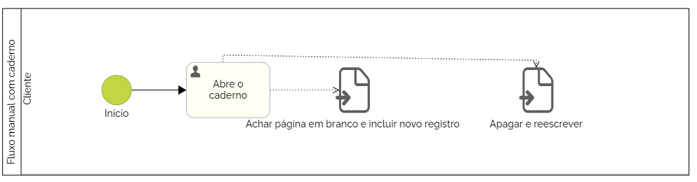
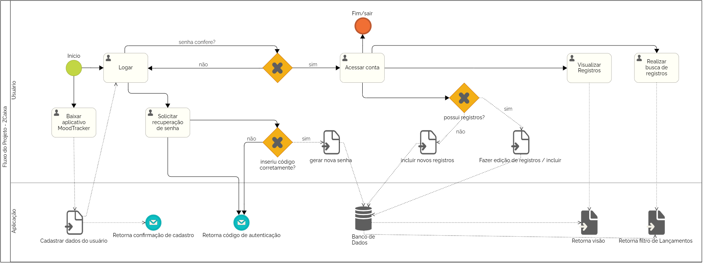
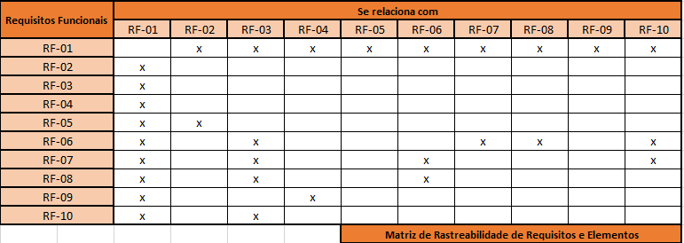

# Especificações do Projeto

Pré-requisitos: <a href="1-Documentação de Contexto.md"> Documentação de Contexto</a>

A definição do problema e os pontos mais relevantes a serem tratados neste projeto foram adquiridos com a participação dos usuários em um trabalho de imersão feita pelos membros da equipe a partir de conversas e entrevistas com potenciais usuários (amigos, familiares, colegas de trabalho). Os dados nesse processo foram consolidados na forma de personas e histórias de usuários.

## Personas

|Mateus Cunha     | Informações:                       |                                        |
|--------------------|------------------------------------|----------------------------------------|
|  | **Idade:** 26 anos   **Ocupação:** Contador |**Aplicativos:** ● Whatsapp  ● Instagram |
|**Motivações:** ● Registrar gatilhos e hábitos diários |**Frustrações:** ● Sempre agir em decorrência de algum gatilho pra realizar alguma vontade, como por exemplo, fumar. |**Hobbies:** ● Vídeo games ● Música  ● Televisão |

|Flavia Lima     | Informações:                       |                                        |
|--------------------|------------------------------------|----------------------------------------|
|  | **Idade:** 23 anos   **Ocupação:** Estagiária |**Aplicativos:** ● Tiktok  ● Instagram ● Whatsapp  |
|**Motivações:** ● Ter um diário para expressar ideias ●  Escrever planos pro dia a dia|**Frustrações:** ● Dificuldade em se lembrar de compromissos e ideias pensadas  ● Ficar ansiosa pensando nas atividades do dia a dia |**Hobbies:** ● Séries  ● Maquiagem  ● Animais de estimação |

|Gabriel Henrique      | Informações:                       |                                        |
|--------------------|------------------------------------|----------------------------------------|
|  | **Idade:** 28 anos   **Ocupação:** Tintureiro |**Aplicativos:** ● Whatsapp  ● FaceTime  ● Instagram  |
|**Motivações:** ● Ser mais paciente  ● Escrever para expressar o estresse  |**Frustrações:** ● Ficar agressivo e ansioso quando esta estressado. |**Hobbies:** ● Leitura ● Praticar exercício físico  ● Natureza |

|Sabrina Souza      | Informações:                       |                                        |
|--------------------|------------------------------------|----------------------------------------|
|  | **Idade:** 22 anos   **Ocupação:** Operadora de Telemarketing |**Aplicativos:** ● Instagram  ● Twitter ● LinkedIn  |
|**Motivações:** ● Descrever seus dias de trabalho  ● Registrar seu humor do dia |**Frustrações:** ● Sente muita pressão no trabalho  ● Percebe muitas variações de humor no trabalho |**Hobbies:** ● Cozinhar ● Corrida  ● Séries | 

## Histórias de Usuários

Com base na análise das personas forma identificadas as seguintes histórias de usuários:

|EU COMO... `PERSONA`| QUERO/PRECISO ... `FUNCIONALIDADE` |PARA ... `MOTIVO/VALOR`                 |
|--------------------|------------------------------------|----------------------------------------|
|Flavia Lima  | Fazer anotações do meu cotidiano   | Utilizar como terapia    |
|Flavia Lima  | Somente eu tenha acesso às minhas anotações | Por motivos de segurança e privacidade | 
|Gabriel Henrique | Criar o hábito de fazer anotações   | Para me auxiliar no dia a dia |
|Gabriel Henrique | Marcar textos com palavras-chaves | Para buscar ou filtrar textos específicos | 
|Mateus Cunha | Anotar meus hábitos gerais | Quero identificar possíveis gatilhos da vontade de fumar|
|Mateus Cunha | Quero ter a possibilidade de excluir meu usuário | Para excluir meus dados já registrados |
|Sabrina Souza | Anotar sobre meus dias no trabalho e registrar meu humor | Quero observar meus registros de humor futuramente|
|Sabrina Souza | Buscar um texto já anotado anteriormente | Para facilitar o acesso aos meus textos | 

## Modelagem do Processo de Negócio 

### Análise da Situação Atual

De acordo com os usuário entrevistados, atualmente a maioria que afirma utilizar um diário como uma ferramenta de auxílio para terapia usam caderno e registram seus textos e emoções de forma manual, que pode ser representado pelo processo no padrão BPMN conforme abaixo:

PROCESSO UTILIZANDO O A SOLUÇÃO

Indicadores de desempenho são medidas calculadas e compostas por métricas, geralmente ao final de cada processo do projeto. Entre os papéis de um indicador estão: transmitir as necessidades e expectativas dos clientes; viabilizar o desdobramento das metas do negócio; dar suporte à análise crítica dos resultados do negócio, às tomadas de decisão e ao novo planejamento; contribuir para a melhoria dos proceso e produtos.

Para construir um indicador é necessário:

- Nomear o indicador;
- Definir seu objetivo;
- Definir unidade de medida;
- Estabelecer periodicidade de cálculo;
- Indicar responsável pela geração e divulgação;
- Definir fórmula de cálculo;
- Indicar seu intervalo de validade;
- Apontar onde e como as variáveis serão capturadas (fonte de dados);
- Definir usuários.

Para este projeto foram definidos 5 indicadores de desempenho, listados abaixo conforme métricas descritas anteriormente:

|  | INDICADOR   |  OBJETIVO   |  UNIDADE | PERIODICIDADE | RESPONSÁVEL |  FÓRMULA | INTERVALO DE VALIDADE | VARIÁVEIS |
|--|-------------|-------------|----------|---------------|-------------|----------|-----------------------|-----------|
|01| Número de Downloads do Aplicativo na App Store | Meta primária de 1.000 downloads/mês | downloads/mês | avaliação mensal | Project Manager | downloads/mês | ideal = >1000 | downloads e tempo|
|02| Avaliações na App Store | Manter médias das avaliações acima de 4 | % de avaliações positivas | mensal | Project Manager | 90% das avaliações acima de 4,5 | ideal = superior a 4,5 | avaliações positivas por mês |
|03| Quantidade de usuários cadastrados | ter pelo menos 500 cadastros/mês | cadastros/mês | mensal | Marketing/Desenvolvimento | cadastros/mês | ideal = acima de 600 cadastros/mês | cadastros e tempo |
|04| Tempo de uso do sistema por usuário | aumentar o tempo de uso por usuário a pelo meno 20min/sem | min/semana | semanal | Marketing/Desenvolvimento | tempo de uso por semana | ideal = acima de 20min por semana | tempo de uso semanal |
|05| Usuários ativos | garantir que usuários estejam ativos pelo menos 3 dias na semana | dias ativos por semana| semana | Equipe de Desenvolvimento | dias ativos por semana | ideal = acima de 3 dias | dias ativos |

 

## Requisitos

As tabelas que se seguem apresentam os requisitos funcionais e não funcionais que detalham o escopo do projeto. Para determinar a prioridade de requisitos, aplicar uma técnica de priorização de requisitos e detalhar como a técnica foi aplicada.

### Requisitos Funcionais

|ID    | Descrição do Requisito  | Prioridade |
|------|-----------------------------------------|----|
|RF-001| Permitir que o usuário cadastre uma conta de acesso | ALTA | 
|RF-002| Permitir que o usuário desative sua conta de acesso   | ALTA |
|RF-003| Permitir que o usuário realize o registro de um texto | ALTA | 
|RF-004| Permitir que o usuário realize o registro de um humor | MÉDIA | 
|RF-005| Permitir que o usuário recupere sua senha de acesso | BAIXA | 
|RF-006| Permitir que o usuário filtre os textos registrados | MÉDIA | 
|RF-007| Permitir que o usuário pesquise os textos registrados | ALTA | 
|RF-008| Permitir que o usuário visualize a quantidade de textos registrados no mês ou filtro | BAIXA | 
|RF-009| Permitir que o usuário visualize o humor mais registrado em um período | MÉDIA | 
|RF-010| Permitir que os textos/anotações sejam tageados por palavras-chave | BAIXA | 

### Requisitos não Funcionais

|ID     | Descrição do Requisito  |Prioridade |
|-------|-------------------------|----|
|RNF-001| O sistema Web deve ser responsivo para rodar em um dispositivos móvel | MÉDIA | 
|RNF-003| Deve processar requisições do usuário em no máximo 5s |  BAIXA | 
|RNF-004| A aplicação deve ter interface responsiva |  ALTA | 
|RNF-005| A aplicação deve ter tela inicial |  ALTA | 
|RNF-006| A aplicação deve ter tela de recuperar a senha |  BAIXA | 
|RNF-007| A aplicação deve permitir o acesso apenas de usuários cadastrados	|  ALTA | 
|RNF-008| A aplicação deve ter bom nível de contraste entre os elementos da tela em conformidade	|  MÉDIA |

## Restrições

O projeto está restrito pelos itens apresentados na tabela a seguir.

|ID| Restrição                                             |
|--|-------------------------------------------------------|
|01| O projeto deverá ser entregue no final do semestre letivo, não extraponlando a data de 10/12/2023.|
|02| A solução deve se restringir às tecnologias básicas de desenvolvimento Mobile React Native, banco de dados, C# backend e HTML, CSS e C# WEB|
|03| A equipe não pode subcontratar o desenvolvimento do trabalho|
|04| A equipe usará o modelo Kanban para o gerenciamento do projeto|
|05| A solução permitirá o uso das funcionalidades apenas para usuários cadastrados|

## Diagrama de Casos de Uso

# Matriz de Rastreabilidade

# Gerenciamento de Projeto e do Tempo (cronograma)

O gerenciamento do Projeto foi realizado em sua maior parte no Projects do GitHub, utilizando o Scrum como meotologia ágil. O gerenciamento foi detalhado na etapa de metodologia.

O cronograma do projeto foi desenvolvido no software MS Project, seguindo as diretrizes de Gerenciamento de Cronograma do PMBOK. Primeiro foi definida a Estrutura Analíta de Projeto (EAP), onde o projeto foi dividido em 5 tarefas e suas subsequentes subtarefas, em seguida foi definido o sequenciamento das atividades e suas durações, seguindo a técnica PERT/CPM. O software calculou automaticamente as folgas e caminho crítico do projeto. O cronograma completo pode ser verficado na imagem abaixo:

## Gerenciamento de Equipe

Desenvolvedores 
•	André Felipe
•	Eduardo Lucci Imakawa de Andrade
•	Gabriel Ferreira
•	Leandro Furtado
•	Pedro
•	Tiago Lobo 

Scrum Master 
•	André Felipe

Product Owner

•	Tiago Lobo

QA Tester
•	Eduardo Lucci Imakawa de Andrade
•	Pedro

Design 
•	Leandro Furtado
•	Gabriel Ferreira
•	Tiago Lobo

## Gestão de Orçamento

Orçamento

Desenvolvedores (Junior)*	R$50.000,00
Hardware	R$21.000,00
Rede	R$2.000,00
Software	R$00,00
TOTAL	R$73.000,00
*Valor pago para trabalhar durante 5 meses.
