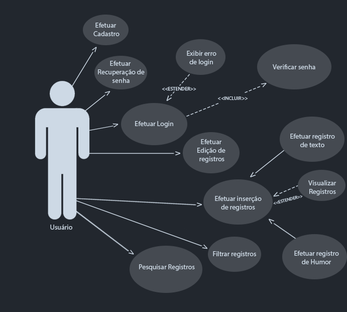

# Especificações do Projeto

Pré-requisitos: <a href="1-Documentação de Contexto.md"> Documentação de Contexto</a>

A definição do problema e os pontos mais relevantes a serem tratados neste projeto foram adquiridos com a participação dos usuários em um trabalho de imersão feita pelos membros da equipe a partir de conversas e entrevistas com potenciais usuários (amigos, familiares, colegas de trabalho). Os dados nesse processo foram consolidados na forma de personas e histórias de usuários.

## Personas

Flavia Lima tem 23 anos e realiza consultas com psicóloga há mais de 3 meses no tratamento de ansiedade e sempre ouvia a sugestão da psicologa de fazer registros escritos do seu dia a dia como forma de expressão e terapia. Hoje ela busca por uma ferramenta onde possa fazer esses registros diários. 

Gabriel Henrique tem 28 anos e faz tratamento anti depressivo, pretende utilizar um diário sempre que se sentir estressado para escrever seus pensamentos como forma de aliviar o stress. 

Mateus Cunha tem 26 anos e fuma cigarro há 5 anos, hoje esta em processo para parar. Pretende utilizar uma ferramenta de anotações para registrar seus hábitos diários a fim de compreender melhor quais são seus gatilhos que despertam a vontade do consumo de cigarro. 

Sabrina Souza tem 22 anos e trabalha de operadora de telemarketing em um callcenter, hoje ela relata que sente muita pressão no trabalho e percebeu um comportamento muito ansioso ultimamente. 

## Histórias de Usuários

Com base na análise das personas forma identificadas as seguintes histórias de usuários:

|EU COMO... `PERSONA`| QUERO/PRECISO ... `FUNCIONALIDADE` |PARA ... `MOTIVO/VALOR`                 |
|--------------------|------------------------------------|----------------------------------------|
|Flavia Lima  | Fazer anotações do meu cotidiano   | Utilizar como terapia    |
|Flavia Lima  | Somente eu tenha acesso às minhas anotações | Por motivos de segurança e privacidade | 
|Gabriel Henrique | Criar o hábito de fazer anotações   | Para me auxiliar no dia a dia |
|Gabriel Henrique | Marcar textos com palavras-chaves | Para buscar ou filtrar textos específicos | 
|Mateus Cunha | Anotar meus hábitos gerais | Quero identificar possíveis gatilhos da vontade de fumar|
|Mateus Cunha | Quero ter a possibilidade de excluir meu usuário | Para excluir meus dados já registrados |
|Sabrina Souza | Anotar sobre meus dias no trabalho e registrar meu humor | Quero observar meus registros de humor futuramente|
|Sabrina Souza | Buscar um texto já anotado anteriormente | Para facilitar o acesso aos meus textos | 

## Modelagem do Processo de Negócio 

### Análise da Situação Atual

Apresente aqui os problemas existentes que viabilizam sua proposta. Apresente o modelo do sistema como ele funciona hoje. Caso sua proposta seja inovadora e não existam processos claramente definidos, apresente como as tarefas que o seu sistema pretende implementar são executadas atualmente, mesmo que não se utilize tecnologia computacional. 

### Descrição Geral da Proposta

Apresente aqui uma descrição da sua proposta abordando seus limites e suas ligações com as estratégias e objetivos do negócio. Apresente aqui as oportunidades de melhorias.

### Processo 1 – NOME DO PROCESSO

Apresente aqui o nome e as oportunidades de melhorias para o processo 1. Em seguida, apresente o modelo do processo 1, descrito no padrão BPMN. 

### Processo 2 – NOME DO PROCESSO

Apresente aqui o nome e as oportunidades de melhorias para o processo 2. Em seguida, apresente o modelo do processo 2, descrito no padrão BPMN.

## Indicadores de Desempenho

Apresente aqui os principais indicadores de desempenho e algumas metas para o processo. Atenção: as informações necessárias para gerar os indicadores devem estar contempladas no diagrama de classe. Colocar no mínimo 5 indicadores. 

Usar o seguinte modelo: 

Obs.: todas as informações para gerar os indicadores devem estar no diagrama de classe a ser apresentado a posteriori. 

## Requisitos

As tabelas que se seguem apresentam os requisitos funcionais e não funcionais que detalham o escopo do projeto. Para determinar a prioridade de requisitos, aplicar uma técnica de priorização de requisitos e detalhar como a técnica foi aplicada.

### Requisitos Funcionais

|ID    | Descrição do Requisito  | Prioridade |
|------|-----------------------------------------|----|
|RF-001| Permitir que o usuário cadastre uma conta de acesso | ALTA | 
|RF-002| Permitir que o usuário desative sua conta de acesso   | ALTA |
|RF-003| Permitir que o usuário realize o registro de um texto | ALTA | 
|RF-004| Permitir que o usuário realize o registro de um humor | MÉDIA | 
|RF-005| Permitir que o usuário recupere sua senha de acesso | BAIXA | 
|RF-006| Permitir que o usuário filtre os textos registrados | MÉDIA | 
|RF-007| Permitir que o usuário pesquise os textos registrados | ALTA | 
|RF-008| Permitir que o usuário visualize a quantidade de textos registrados no mês ou filtro | BAIXA | 
|RF-009| Permitir que o usuário visualize o humor mais registrado em um período | MÉDIA | 
|RF-010| Permitir que os textos/anotações sejam tageados por palavras-chave | BAIXA | 

### Requisitos não Funcionais

|ID     | Descrição do Requisito  |Prioridade |
|-------|-------------------------|----|
|RNF-001| O sistema Web deve ser responsivo para rodar em um dispositivos móvel | MÉDIA | 
|RNF-003| Deve processar requisições do usuário em no máximo 5s |  BAIXA | 
|RNF-004| A aplicação deve ter interface responsiva |  ALTA | 
|RNF-005| A aplicação deve ter tela inicial |  ALTA | 
|RNF-006| A aplicação deve ter tela de recuperar a senha |  BAIXA | 
|RNF-007| A aplicação deve permitir o acesso apenas de usuários cadastrados	|  ALTA | 
|RNF-008| A aplicação deve ter bom nível de contraste entre os elementos da tela em conformidade	|  MÉDIA |

## Restrições

O projeto está restrito pelos itens apresentados na tabela a seguir.

|ID| Restrição                                             |
|--|-------------------------------------------------------|
|01| O projeto deverá ser entregue no final do semestre letivo, não extraponlando a data de 10/12/2023.|
|02| A solução deve se restringir às tecnologias básicas de desenvolvimento Mobile React Native, banco de dados, C# backend e HTML, CSS e C# WEB|
|03| A equipe não pode subcontratar o desenvolvimento do trabalho|
|04| A equipe usará o modelo Kanban para o gerenciamento do projeto|
|05| A solução permitirá o uso das funcionalidades apenas para usuários cadastrados|

## Diagrama de Casos de Uso

O diagrama de casos de uso é o próximo passo após a elicitação de requisitos, que utiliza um modelo gráfico e uma tabela com as descrições sucintas dos casos de uso e dos atores. Ele contempla a fronteira do sistema e o detalhamento dos requisitos funcionais com a indicação dos atores, casos de uso e seus relacionamentos. 

# Matriz de Rastreabilidade

A matriz de rastreabilidade é uma ferramenta usada para facilitar a visualização dos relacionamento entre requisitos e outros artefatos ou objetos, permitindo a rastreabilidade entre os requisitos e os objetivos de negócio. 

A matriz deve contemplar todos os elementos relevantes que fazem parte do sistema, conforme a figura meramente ilustrativa apresentada a seguir.

> **Links Úteis**:
> - [Artigo Engenharia de Software 13 - Rastreabilidade](https://www.devmedia.com.br/artigo-engenharia-de-software-13-rastreabilidade/12822/)
> - [Verificação da rastreabilidade de requisitos usando a integração do IBM Rational RequisitePro e do IBM ClearQuest Test Manager](https://developer.ibm.com/br/tutorials/requirementstraceabilityverificationusingrrpandcctm/)
> - [IBM Engineering Lifecycle Optimization – Publishing](https://www.ibm.com/br-pt/products/engineering-lifecycle-optimization/publishing/)

# Gerenciamento de Projeto

De acordo com o PMBoK v6 as dez áreas que constituem os pilares para gerenciar projetos, e que caracterizam a multidisciplinaridade envolvida, são: Integração, Escopo, Cronograma (Tempo), Custos, Qualidade, Recursos, Comunicações, Riscos, Aquisições, Partes Interessadas. Para desenvolver projetos um profissional deve se preocupar em gerenciar todas essas dez áreas. Elas se complementam e se relacionam, de tal forma que não se deve apenas examinar uma área de forma estanque. É preciso considerar, por exemplo, que as áreas de Escopo, Cronograma e Custos estão muito relacionadas. Assim, se eu amplio o escopo de um projeto eu posso afetar seu cronograma e seus custos.

## Gerenciamento de Tempo

10/09/2023 • 1ª ETAPA: Concepção, Proposta de Solução e Início da Elaboração do Projeto da Solução 
           • Documento de Contexto
           • Especificação do Problema
           • Documentação dos perfis de usuários, suas necessidades e Personas.
           • Documentação da Arquitetura Distribuída
           • Documentação dos requisitos funcionais e não funcionais do projeto de acordo com o contexto levantado       
01/10/2023 • 2ª ETAPA: Desenvolvimento do Back-end:  Web API
           • Documentação da arquitetura da aplicação distribuída
           • Projeto da arquitetura baseada em API
           • Implementação da API e testes de unidade
           • Documentação com justificativa e avaliação do modelo de dados NoSQL para o contexto da aplicação
           • Implementação das funcionalidades que envolvem o banco de dados NoSQL para armazenamento e recuperação de dados
29/10/2023 • 3ª ETAPA: Desenvolvimento do Front-end: Web
           • Documentação do projeto de interface e do fluxo de telas do sistema de uma aplicação web
           • Implementação do projeto de interface, fluxo de telas do sistema de uma aplicação web e testes de integração.
26/11/2023 • 4ª ETAPA: Desenvolvimento do Front-end: Mobile
           • Documentação do projeto de interface e fluxo de telas do sistema de uma aplicação mobile
           • Implementação do projeto de interface, fluxo de telas do sistema de uma aplicação mobile testes de sistema
10/12/2023 • 5ª ETAPA: Diagnóstico, entrega da solução e apresentação
           • Projeto final
           • Considerações finais
           • Entrega do Vídeo da Apresentação Final e PDF usado na Apresentação
           • Realização da Apresentação Final

## Gerenciamento de Equipe

Desenvolvedores 
•	André Felipe
•	Eduardo Lucci Imakawa de Andrade
•	Gabriel Ferreira
•	Leandro Furtado
•	Pedro
•	Tiago Lobo 

Scrum Master 
•	André Felipe

Product Owner

•	Tiago Lobo

QA Tester
•	Eduardo Lucci Imakawa de Andrade
•	Pedro

Design 
•	Leandro Furtado
•	Gabriel Ferreira
•	Tiago Lobo

## Gestão de Orçamento

Orçamento

Desenvolvedores (Junior)*	R$50.000,00
Hardware	R$21.000,00
Rede	R$2.000,00
Software	R$00,00
TOTAL	R$73.000,00
*Valor pago para trabalhar durante 5 meses.
