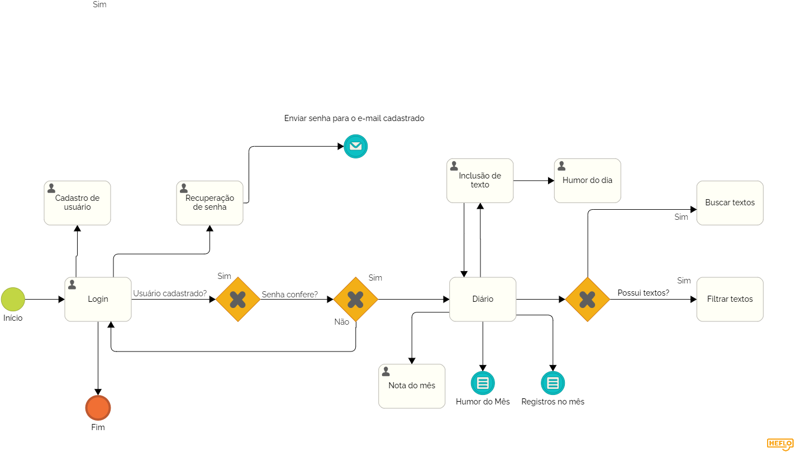
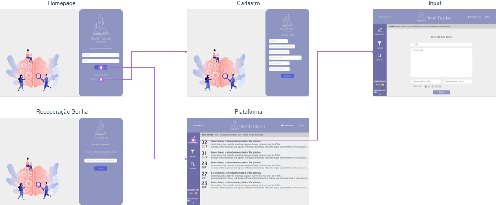

# Projeto de Interface

Pré-requisitos: <a href="2-Especificação do Projeto.md"> Documentação de Especificação</a>

Visão geral da interação do usuário pelas telas do sistema e protótipo interativo das telas com as funcionalidades que fazem parte do sistema (wireframes).

 Apresente as principais interfaces da plataforma. Discuta como ela foi elaborada de forma a atender os requisitos funcionais, não funcionais e histórias de usuário abordados nas <a href="2-Especificação do Projeto.md"> Documentação de Especificação</a>.

## Diagrama de Fluxo

O diagrama apresenta o estudo do fluxo de interação do usuário com o sistema interativo. Isso permite que o design das interações seja bem planejado e gere impacto na qualidade no design do wireframe interativo.

## Wireframes

Visão geral da interação do usuário pelas telas do sistema e protótipo interativo das telas com as funcionalidades que fazem parte do sistema (wireframes) via MarvelApp.

Mapa de Fluxo e Wireframes:

<a href="https://marvelapp.com/prototype/c13jb5h" target="_blank"> Link Wireframe Interativo</a>

Estabelecendo foco em questões como agilidade e usabilidade. O projeto tem identidade visual padronizada em todas as telas e são projetadas para funcionamento em dispositivos WEB.

Atendendo os requisitos funcionais RF-001, RF-005, RF-010  e não funcionais RNF-005, RNF-006, RNF-007 a tela "Homepage", "Cadastro", "Recuperação Senha" é apresentada ao usuário referente ao acesso à aplicação. Onde é solicitado as credenciais para quem já possui um cadastro, a opção para recuperação de senha e opção para cadastramento. 

Plataforma: Sendo a primeira tela de exibição ao realizar o acesso, é apresentado ao usuário os registros do mês e ano vigente (ao acesso), sendo possível a alteração do filtro por mês e ano no menu lateral. Cada registro age como um botão que exibe o texto, humor, o que deixou feliz e o que deixou triste registrado, permitindo alterar ou deletar o mesmo. No menu lateral também possui opção de filtragem (por mês e ano) e pesquisa de registros e exibição da quantdade de registros e do humor mais escolhido no mês. Na parte superior possui a opção configurações que permite o usuário alterar dados cadastrais e desativar a conta. (Requisitos atendidos: RF-003, RF-002, RF-004, RF-006, RF-007, RF-008, RF-009, RF-010 e RF-011)

