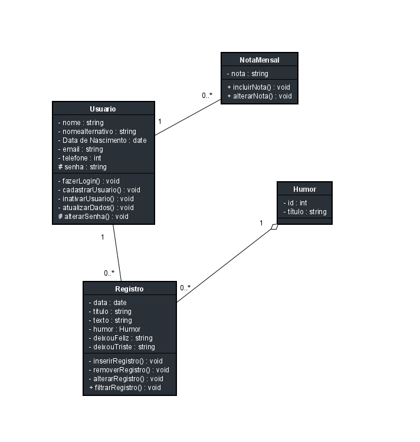

# Arquitetura da Solução

Pré-requisitos: <a href="3-Projeto de Interface.md"> Projeto de Interface</a>

Nesta etapa foi definida a estruturação do software  em termos dos componentes que fazem parte da solução e do ambiente de hospedagem da aplicação.

## Diagrama de Classes

O diagrama de classes ilustra graficamente como será a estrutura do software, e como cada uma das classes da sua estrutura estarão interligadas. Essas classes servem de modelo para materializar os objetos que executarão na memória.

## Modelo ER

O Modelo ER representa através de um diagrama como as entidades (coisas, objetos) se relacionam entre si na aplicação interativa.]

As referências abaixo irão auxiliá-lo na geração do artefato “Modelo ER”.

> - [Como fazer um diagrama entidade relacionamento | Lucidchart](https://www.lucidchart.com/pages/pt/como-fazer-um-diagrama-entidade-relacionamento)

## Esquema Relacional

O Esquema Relacional corresponde à representação dos dados em tabelas juntamente com as restrições de integridade e chave primária.
 
As referências abaixo irão auxiliá-lo na geração do artefato “Esquema Relacional”.

> - [Criando um modelo relacional - Documentação da IBM](https://www.ibm.com/docs/pt-br/cognos-analytics/10.2.2?topic=designer-creating-relational-model)

## Banco de Dados

A escolha do MongoDB como banco de dados NoSQL para uma aplicação de registro de textos e humor, seguindo o método de escrita de um diário, é justificada pelas seguintes razões:

### Flexibilidade na Modelagem de Dados:
O MongoDB permite uma modelagem flexível de dados, adequada para a natureza livre e variável das entradas de diário.

### Suporte a Dados Textuais:
É eficaz para armazenar e consultar dados textuais, essenciais para registros de diário.

### Escalabilidade:
O MongoDB é escalável horizontalmente, acomodando o crescimento de dados ao longo do tempo.

### Modelo de Dados Proposto:
O modelo de dados NoSQL proposto para a aplicação de registro de textos e emoções consiste em duas principais coleções: "Diários" e "Emoções".

###Coleção "Diários":
A coleção "Diários" é responsável por armazenar as entradas individuais do diário. Cada documento nessa coleção terá os seguintes campos:

_id: Um identificador exclusivo para cada entrada do diário.
data: A data e hora da entrada.
texto: O texto da entrada do diário.
id_usuario: O identificador do usuário que fez a entrada.
emoção_id: Um campo de referência à coleção "Emoções", indicando a emoção associada à entrada (pode ser nulo).

###Coleção "Emoções"
A coleção "Emoções" armazena informações sobre as emoções registradas pelos usuários em suas entradas do diário. Cada documento nessa coleção terá os seguintes campos:

_id: Um identificador exclusivo para cada registro de emoção.
nome: O nome da emoção (por exemplo, "Feliz", "Triste", "Empolgado").
descrição: Uma descrição mais detalhada da emoção.
cor: Uma cor associada à emoção para fins de visualização.
id_usuario: O identificador do usuário que associou a emoção (pode ser nulo).

Entregar um arquivo banco.sql contendo os scripts de criação das tabelas do banco de dados. Este arquivo deverá ser incluído dentro da pasta src\bd.

## Tecnologias Utilizadas

A arquitetura da solução foi simplificada em três categorias: cliente, API e Banco de Dados (conforme figura abaixo).

### Camada de Cliente:

React para Web: Desenvolveu-se a versão da web do aplicativo React usando componentes React e bibliotecas como o React Router para gerenciar a navegação.

React Native para Dispositivos Móveis: Usou-se o React Native para criar versões nativas do aplicativo para iOS e Android. Compartilhou-se a maior quantidade possível de código entre as versões da web e móvel, aproveitando bibliotecas e estruturas de componentes compatíveis.

Gestão de Estado: Utilizou-se bibliotecas de gerenciamento de estado como Redux ou MobX para compartilhar e gerenciar o estado do aplicativo entre as diferentes plataformas.

Autenticação e Autorização: Implementou-se um sistema de autenticação seguro, como JWT (JSON Web Tokens), para proteger as rotas e recursos do aplicativo.

### Camada de API:

ASP.NET: Desenvolveu-se a camada de API REST usando ASP.NET. Foi possível escolher entre ASP.NET Core ou ASP.NET Framework, dependendo das necessidades e preferências.

Roteamento: Configurou-se rotas RESTful que correspondiam a endpoints de recursos, como /api/users para gerenciar usuários ou /api/products para produtos.

Lógica de Negócios: Implementou-se a lógica de negócios no backend para processar solicitações do cliente, validar dados e interagir com o banco de dados.

Middleware de Autenticação: Utilizou-se middleware de autenticação para verificar tokens JWT e autenticar solicitações de clientes.

### Camada de Banco de Dados:

MongoDB: Utilizou-se o MongoDB como banco de dados NoSQL para armazenar dados de forma flexível e escalável.

Esquema: Definiu-se os esquemas de coleção de acordo com as necessidades do aplicativo, estando preparados para lidar com mudanças nos esquemas ao longo do tempo.

### As ferramentas empregadas no projeto foram:

- Editor de código : Visual Studio Code;
- Emulador da aplicação: Android Expo, NPM;
- Ferramentas de comunicação: Whatsapp, Teams;
- Gerencimaneto do projeto: GitHub Projects e MS Project;
- Ferramentas de desenho de tela (wireframing): MarvelAPP, Heflo e Figma;
- Ferramentas para diagramas (conceitual e lógico): Diagrams.net, Astah, Lucid Charts, BRMW e Figma;
- Versionamento de código: GitHub e GitHub desktop.

O editor de código foi escolhido pelo grupo pois é o mais prático e acessível para os integrantes, além de facilitar a alternação de quem está editando o código e salvando diretamente no reposítorio através do GitHub Desktop. Tem um bom dicionário de erros no código e permite acompanhar alterações em tempo real através do emulador do android studio.

## Hospedagem

O backend da aplicação está hospedado na plataforma Azure, garantindo uma infraestrutura sólida e confiável. 

O banco de dados, por sua vez, encontra-se em um servidor dedicado e seguro, assegurando a integridade dos dados. 

A aplicação estará assim que pronto, disponível para download na loja Google Play, atendendo a todos os utilizadores do sistema Android.

## Qualidade de Software

Conceituar qualidade de fato é uma tarefa complexa, mas ela pode ser vista como um método gerencial que através de procedimentos disseminados por toda a organização, busca garantir um produto final que satisfaça às expectativas dos stakeholders.

No contexto de desenvolvimento de software, qualidade pode ser entendida como um conjunto de características a serem satisfeitas, de modo que o produto de software atenda às necessidades de seus usuários. Entretanto, tal nível de satisfação nem sempre é alcançado de forma espontânea, devendo ser continuamente construído. Assim, a qualidade do produto depende fortemente do seu respectivo processo de desenvolvimento.

A norma internacional ISO/IEC 25010, que é uma atualização da ISO/IEC 9126, define oito características e 30 subcaracterísticas de qualidade para produtos de software.
Com base nessas características e nas respectivas sub-características, identifique as sub-características que sua equipe utilizará como base para nortear o desenvolvimento do projeto de software considerando-se alguns aspectos simples de qualidade. Justifique as subcaracterísticas escolhidas pelo time e elenque as métricas que permitirão a equipe avaliar os objetos de interesse.

> **Links Úteis**:
>
> - [ISO/IEC 25010:2011 - Systems and software engineering — Systems and software Quality Requirements and Evaluation (SQuaRE) — System and software quality models](https://www.iso.org/standard/35733.html/)
> - [Análise sobre a ISO 9126 – NBR 13596](https://www.tiespecialistas.com.br/analise-sobre-iso-9126-nbr-13596/)
> - [Qualidade de Software - Engenharia de Software 29](https://www.devmedia.com.br/qualidade-de-software-engenharia-de-software-29/18209/)
