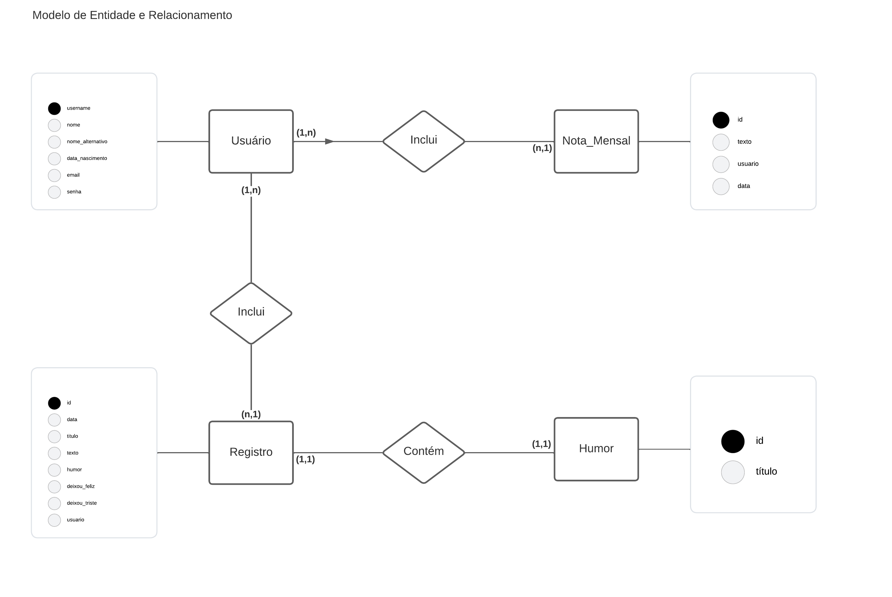

# Arquitetura da Solução

Pré-requisitos: <a href="3-Projeto de Interface.md"> Projeto de Interface</a>

Nesta etapa foi definida a estruturação do software  em termos dos componentes que fazem parte da solução e do ambiente de hospedagem da aplicação.

## Diagrama de Classes

O diagrama de classes ilustra graficamente como será a estrutura do software, e como cada uma das classes da sua estrutura estarão interligadas. Essas classes servem de modelo para materializar os objetos que executarão na memória.

## Modelo ER (Projeto Conceitual)

O Modelo ER representa através de um diagrama como as entidades (coisas, objetos) se relacionam entre si na aplicação interativa.

## Esquema Relacional
O Esquema Relacional corresponde à representação dos dados em tabelas juntamente com as restrições de integridade e chave primária.

## Banco de Dados
A aplicação irá utilizar dois bancos de dados, um relacional provido pelo SQLExpress e um não relacional no MongoDB.

### Modelo de Dados Proposto:
O modelo de dados NoSQL irá tratar a tabela de usuários da aplicação bem como as questões de autenticação e segurança. Já o modelo relacional SQL irá conter a estrutura necessárias das tabelas Registros, Humor e NotaMensal da aplicação.

### Coleção "Registros":
A coleção "Registros" é responsável por armazenar uma entrada individual do usuário por dia. Cada documento nessa coleção terá os seguintes campos:

- id: Um identificador exclusivo para cada entrada do diário.
- data: A data e hora da entrada.
- titulo: Titulo da entrada.
- texto: O texto da entrada do diário.
- humor: chave etrangeira da tabela Humor.
- username: chave estrangeira do usuário que fez a entrada.
- Registro feliz: texto para inserir uma reflexão do que trouxe felicidade no dia.
- Registro feliz: texto para inserir uma reflexão do que trouxe tristeza no dia.
- 
### Coleção "Humor"
A coleção "Humor" armazena informações sobre as emoções registradas pelos usuários em suas entradas do diário. Cada documento nessa coleção terá os seguintes campos:

- id: Um identificador exclusivo para cada registro de humor.
- Titulo: O nome da emoção (por exemplo, "Feliz", "Triste", "Empolgado").

### Coleção "Usuarios"
A coleção "Usuarios" armazena informações sobre usuário registrados na aplicação:

- Username: Chave primária da tabela que é definida pelo usuário.
- Nome: O nome do usuário.
- Nome_alternativo: Nome alternativo o qual o usuário gostaria de ser tratado pela aplicação (pode ser nulo).
- Data_Nascimento: Data de nascimento do usuário.
- Email: Endereço de e-mail do usuário.
- Senha: Senha criptografada definida pelo usuário.

### Coleção "Nota_Mensal"
A coleção "NotaMensal" armazena informações sobre uma nota ou mensagem que o usuário gostaria de enfatizar na aplicação durante o mês vigente:

- id: Um identificador exclusivo para cada entrada do diário.
- username: chave estrangeira do usuário que fez a entrada.
- data: A data e hora da entrada.
- texto: O texto da entrada da nota mensal.
 
O Arquivo que contém os scripts de criação do banco de dados foi gerado pelo Entity Framework junto com a criação da API utilizando o conceito de "Migrações" ou "Migrations.
Cada arquivo migration guarda o histórico desde a criação à alterações no banco de dados que podem ser verificadas neste <a href='https://github.com/ICEI-PUC-Minas-PMV-ADS/pmv-ads-2023-2-e4-proj-infra-t1-pmv-ads-2023-2-e4-projmoodtracker/tree/main/src/API/MoodTracker_API/MoodTracker/Migrations' target="_blank" > Link </a>

## Tecnologias Utilizadas

A arquitetura da solução foi simplificada em três categorias: cliente, API e Banco de Dados (conforme figura abaixo).

### Camada de Cliente:

React para Web: Desenvolveu-se a versão da web do aplicativo React usando componentes React e bibliotecas como o React Router para gerenciar a navegação.

React Native para Dispositivos Móveis: Usou-se o React Native para criar versões nativas do aplicativo Android. Compartilhou-se a maior quantidade possível de código entre as versões da web e móvel, aproveitando bibliotecas e estruturas de componentes compatíveis.

Gestão de Estado: Utilizou-se bibliotecas de gerenciamento de estado como Redux ou MobX para compartilhar e gerenciar o estado do aplicativo entre as diferentes plataformas.

Autenticação e Autorização: Implementou-se um sistema de autenticação seguro, como JWT (JSON Web Tokens), para proteger as rotas e recursos do aplicativo.

### Camada de API:

ASP.NET: Desenvolveu-se a camada de API REST usando ASP.NET. Foi possível escolher entre ASP.NET Core ou ASP.NET Framework, dependendo das necessidades e preferências.

Roteamento: Configurou-se rotas RESTful que correspondiam a endpoints de recursos, como /api/users para gerenciar usuários ou /api/products para produtos.

Lógica de Negócios: Implementou-se a lógica de negócios no backend para processar solicitações do cliente, validar dados e interagir com o banco de dados.

Middleware de Autenticação: Utilizou-se middleware de autenticação para verificar tokens JWT e autenticar solicitações de clientes.

### Camada de Banco de Dados:

#### SQL Server:

O modelo de SQL irá conter a estrutura necessárias das tabelas Registros, Humor e NotaMensal da aplicação.

#### MongoDB: Utilizou-se o MongoDB como banco de dados NoSQL para tratar a tabela de usuários da aplicação bem como as questões de autenticação e segurança.

### As ferramentas empregadas no projeto foram:

- Editor de código : Visual Studio Code;
- Emulador da aplicação: Android Expo, NPM;
- Ferramentas de comunicação: Whatsapp, Teams;
- Gerencimaneto do projeto: GitHub Projects e MS Project;
- GUI dos Banco de Dados: SQL Express e Robo 3T para MongoDB
- Ferramentas de desenho de tela (wireframing): MarvelAPP e Figma;
- Ferramentas para diagramas (conceitual e lógico): Diagrams.net, Astah, Heflo, Lucid Chart, BRMW e Figma;
- Versionamento de código: GitHub e GitHub desktop.

O editor de código foi escolhido pelo grupo pois é o mais prático e acessível para os integrantes, além de facilitar a alternação de quem está editando o código e salvando diretamente no reposítorio através do GitHub Desktop. Tem um bom dicionário de erros no código e permite acompanhar alterações em tempo real através do emulador do android studio.

## Hospedagem

O backend da aplicação está hospedado na plataforma Azure, garantindo uma infraestrutura sólida e confiável. 

O banco de dados, por sua vez, encontra-se em um servidor dedicado e seguro, assegurando a integridade dos dados. 

A aplicação estará assim que pronto, disponível para download na loja Google Play, atendendo a todos os utilizadores do sistema Android.

## Qualidade de Software

Sabemos que a qualidade de software é a medida em que um software atende aos requisitos do usuário e aos padrões de qualidade estabelecidos. Isso inclui a capacidade do software de funcionar corretamente, de ser fácil de usar e de ser seguro e confiável. A qualidade de software também pode ser medida pela eficiência e eficácia do software, como o seu desempenho por exemplo.

Sendo assim o aplicativo do MoodTracker passou por um rígido processo de controle de qualidade. Foi desenvolvido para ajudar os usuários a relatar suas experiências, tanto positivas quanto negativas assim como uma válvula de escape para relatar seus problemas, refletir e acompanhar seu humor. O aplicativo possui uma interface intuitiva e fácil de usar, o que o torna acessível para usuários de todos os níveis de habilidade. Além disso, é uma aplicação de alta segurança e performance, voltada para o uso pessoal. Ele terá uma escala de humor e opção de exportar as informações sempre que quiser.

Segundo a NBR ISO/IEC 9126 realizamos processo do controle de qualidade do projeto MoodTracker a partir das seguintes características e sub características.

Funcionalidade: Ajuda os usuários a criar relatos diários. Incluir o nível de humor diário oferece recursos de para exportar e filtros.

* Adequação: Presença de conjunto de funções e sua apropriação para tarefas.
* Acurácia: Geração de resultados ou efeitos corretos;
* Conformidade: Estar de acordo com normas, convenções e regulamentações.

Confiabilidade: É seguro e confiável. Possui autenticação (Login/Cadastro) de usuários. Garante a proteção das informações pessoais dos usuários. 

* Segurança de Acesso: Capacidade de evitar acesso não autorizado a programas e dados;
* Maturidade: Indicação de baixa frequência de falhas;
* Tolerância a falhas: Manter nível de desempenho em caso de falha;
* Recuperabilidade: Capacidade de se restabelecer e restaurar dados após falha.

Portabilidade: Disponível como aplicação web e mobile. Oferece suporte a diferentes sistemas operacionais. 

* Adaptabilidade: Capacidade de ser adaptado a ambientes diferentes;
* Capacidade para ser testado: Medida do esforço necessário para se instalar o produto;
* Conformidade: Medida do nível de conformidade do produto com padrões referentes à portabilidade;
* Capacidade para substituir: Medida de esforço necessário para usar o produto em substituição a outro, previamente especificado.

Manutenibilidade: Possui atualizações regulares para melhorias e correções; oferece suporte técnico aos usuários; mantém um registro de erros e bugs para solucioná-los de forma eficaz.

* Analisabilidade: Facilidade de diagnosticar deficiências e causas de falhas;
* Modificabilidade: Facilidade de modificação e remoção de defeitos;
* Estabilidade: Ausência de riscos de efeitos inesperados;
* Testabilidade: Facilidade de ser testado.

Eficiência: Tempo de resposta satisfatório e requisitos de hardware baixos provando ser uma aplicação funcional para todos os tipos de aparelhos e usuários.

*  Comportamento em relação a tempo: tempo de resposta, de processamento
*  Comportamento em relação a recursos: medida da quantidade de recursos necessários (CPU, disco e memória, dentre outros) e a duração; 

Em resumo, o MoodTracker é um exemplo de software de qualidade, que oferece aos usuários um conjunto abrangente de recursos para os usuários conseguirem relatar seus dilemas diários. Auxiliar a acompanhar e relatar todas as informações que desejarem incluir. Com interface intuitiva e recursos de segurança avançados, o aplicativo é a escolha perfeita para quem deseja manter um acompanhamento diário, das alterações de humor, emoções e possíveis conflitos enfrentados com eficiência e confiabilidade.

