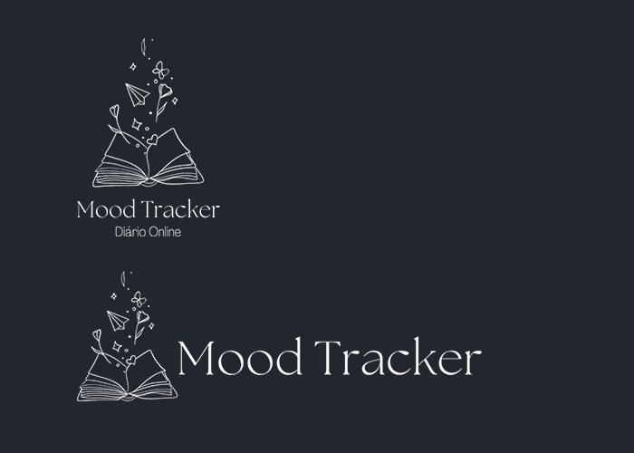
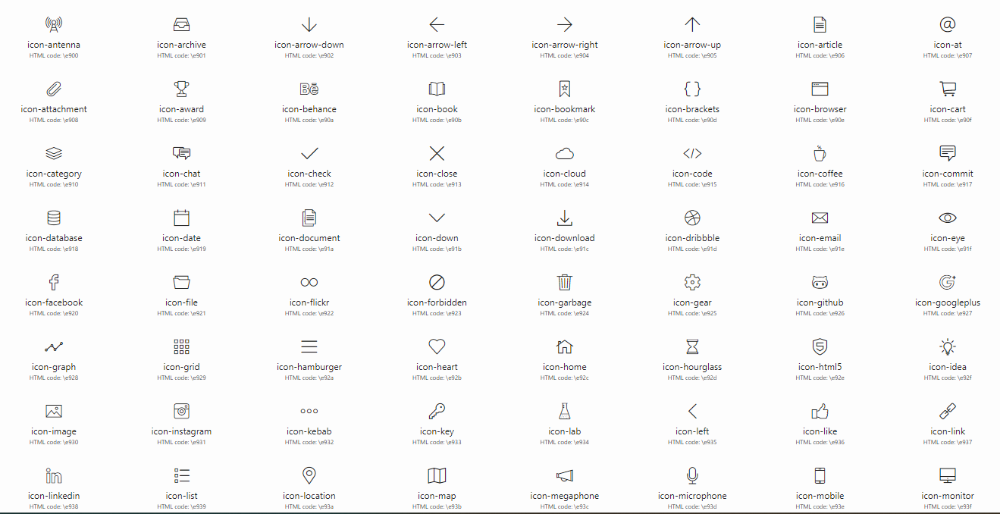
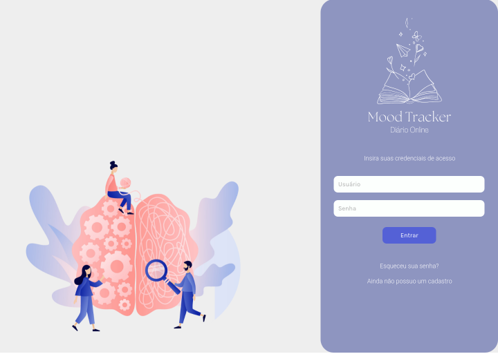
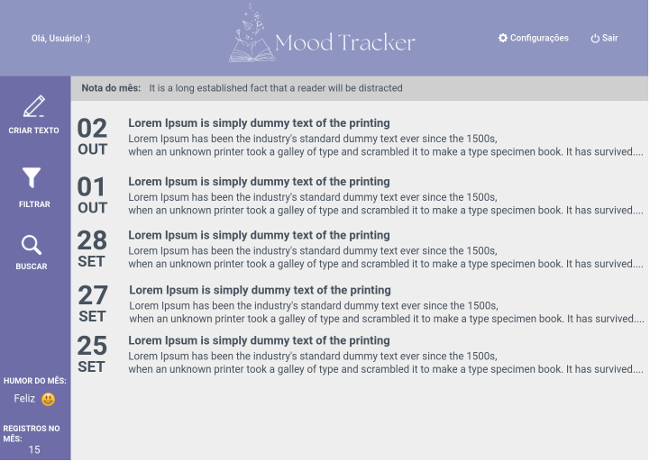

# Template Padrão da Aplicação

A estrutura da interface desktop e mobile seguirão um padrão comum entre as telas de login, cadastro de usuário, recuperação de senha e também entre as telas da plataforma (após logado) que terão divs dinâmicas de acordo com a funcionalidade utilizada pelo usuário.

### Logomarca, Cores padrões e iconografia

Através do Canva - ferramenta de criação de artes gráficas grátis - definimos o nome e a logomarca da aplicação, denominada MoodTracker. A logomarca possui duas variações, sendo sua versão de forma vertical e horizontal que serão usadas em diferentes telas pelas páginas da aplicação.

Já a fonte, selecionamos a "Roboto" com as espressuras 100, 300, 400, 500 e 700 disponibilizada pelo Google Fonts gratuitamente. 

Selecionamos a iconografia grátis disponibilizada pelo site http://www.gonzodesign.nl/gonzocons/ onde contém os ícones que seguirá o padrão visual da aplicação como um todo, e atende de forma clara e objetiva a comunicação com o usuário de acordo com sua finalidade.

#### Desktop: 

#### Mobile:

**************

### Páginas com o usuário desconectado no Desktop

Antes de realizar a autenticação o usuário poderá navegar entre as páginas de Login, Cadastro e Recuperação de Senha.

### Páginas com o usuário conectado no Desktop 

As telas onde o usuário estiver autenticado apresentará a interface da plataforma com o conteúdo do usuário conectado. 

### Fontes  

Roboto

#### Título:  

Tamanho 26  

#### Texto comum:  

Tamanho 23 
