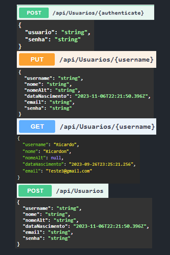
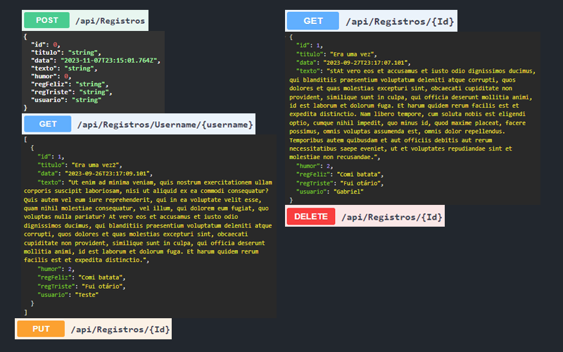
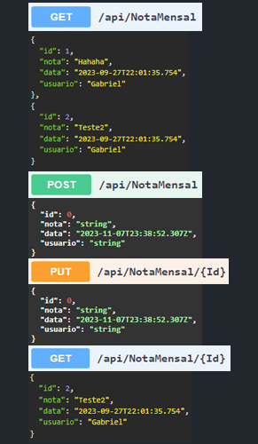

# Programação de Funcionalidades

Pré-requisitos: <a href="2-Especificação do Projeto.md"> Especificação do Projeto</a>, <a href="3-Projeto de Interface.md"> Projeto de Interface</a>, <a href="4-Metodologia.md"> Metodologia</a>, <a href="3-Projeto de Interface.md"> Projeto de Interface</a>, <a href="5-Arquitetura da Solução.md"> Arquitetura da Solução</a>

O presente projeto é composto por uma API, Aplicação WEB e Aplicação Mobile, seguimos realizando o desenvolvimento do projeto por meio Local. Ao finalizar as alterações necessárias e realizando commit para o presente respositório. Outro membro do grupo pode importar as atualizações por meio do GitHub Desktop e dar andamento por meio das ferramentes de forma local.

## API
A API, que torna o projeto uma aplicação distriuída, foi desenvolvida através do Visual Studio Community 2022 na linguagem C#. Para as funcionalidades necessárias para o projeto foi necessário a adição de alguns pacotes nuget em suas dependências, sendo eles:

> - Bcrypt.Net V4.0.3
> - Microsoft.AspnetCore.Authentication.JwtBearer V6.0.22
> - Microsoft.EntityFrameworkCore V7.0.11
> - Microsoft.EntityFramerworkCore.Sqlite V6.0.21
> - Microsoft.EntityFramerworkCore.SqlServer V7.0.11
> - Microsoft.EntityFramerworkCore.Tools V7.0.11

<h3>Controllers:</h3>
A API possui os controladores de cada modelo (classes) para a determinação das rotas de acesso para obtenção ou manipulação dos dados no banco de dados.  

<h4>UsuariosController</h4>
Determina as rotas da classe Usuarios, permitindo a criação, atualização e autenticação do usuário na aplicação.
Também possui rotas para um obtenção de todos os usuários cadastrados na aplicação e obtenção dos dados de um usuário específico pelo nome de usuário.

<h4>RegistrosController</h4>
Determina as rotas da classe Registros, permitindo a criação, atualização e deleção de registros de usuários na aplicação.
Também possui rotas para um obtenção de todos os registros cadastrados na aplicação e obtenção dos registros por ID ou Usuário.

<h4>NotaMensalController</h4>
Determina as rotas da classe NotaMensal, permitindo a criação e atualização das notas mensais de usuários na aplicação.
Também possui rotas para um obtenção de todos as notas cadastradas na aplicação e obtenção das notas por ID ou Usuário.

## Aplicação WEB

A aplicação WEB foi desenvolvida no editor Visual Studio Code utilizando a biblioteca JavaScript React, especialmente útil para SPAs (Single Page Applications) e possuindo como principal característica a componentização. Foi utilizado o Vite junto ao React, que oferece um template pré-configurado e suporte HMR, e styled-components, biblioteca que permite utilizar o CSS diretamente no JavaScript.

Atendendo aos requisitos RF-001	e RF-005, foi implementado o front-end das telas com as funcionalidades de login, cadastro e recuperação de senha. As pastas  SignIn, SignUp e ChangePass contêm o arquivo index.jsx com os códigos tanto HTML quanto as funcionalidades da página em JavaScript, e o arquivo styled.js contém a estilização CSS especifica da página, sendo que demais componentes são importados da pasta 'components' do projeto.
 
Abaixo estão as descrições das páginas e links para as pastas com os códigos:

 **SignIn**  
Na página Login (SignIn) o usuário pode navegar para a área de cadastro ou recuperação de senha. Nela estão todas as funções necessárias para a autenticação do usuário como validação de preenchimento dos campos, função de login e passagem de valores para o contexto do usuário.
 <a href="https://github.com/ICEI-PUC-Minas-PMV-ADS/pmv-ads-2023-2-e4-proj-infra-t1-pmv-ads-2023-2-e4-projmoodtracker/tree/37bb5aea5ad3a452974193310e8784772907c4a3/src/WEB/MoodTracker_WEB/pages/SignIn
">Link do Pasta</a>

 **SignUp** 
A página de cadastro (SignUp) contém o formulário para a criação de uma conta para utilizar a aplicação. Nela estão contidas as funções necessárias para o cadastro como a verificação dos dados preenchidos e envio dos dados para a API.
 <a href="https://github.com/ICEI-PUC-Minas-PMV-ADS/pmv-ads-2023-2-e4-proj-infra-t1-pmv-ads-2023-2-e4-projmoodtracker/tree/4a729f1d4f9ffa3c3dc8190d4a5011455154281a/src/WEB/MoodTracker_WEB/pages/SignUp">Link do Pasta</a>

 **ChangePass** 
A página de mudança de senha (ChangePass) é onde está o formulário para a alteração da senha do usuário através do envio de um token único pelo e-mail do mesmo. Nela estão contidas as funções necessárias para a geração do token e envio automático para o e-mail.
 <a href="https://github.com/ICEI-PUC-Minas-PMV-ADS/pmv-ads-2023-2-e4-proj-infra-t1-pmv-ads-2023-2-e4-projmoodtracker/tree/4a729f1d4f9ffa3c3dc8190d4a5011455154281a/src/WEB/MoodTracker_WEB/pages/ChangePass">Link do Pasta</a>

 **Home** 
Para atender aos requisitos RF-006, RF-007, RF-008, RF-009, foi gerada a página Home, acessada após a autenticação do usuário na aplicação. Ela apresenta as notas criadas, com possibilidade de friltrar e pesquisar com base em data e humor, apresenta também a nota mensal e humor médio das notas do mês cadastras pelo usuário. A partir desta página o usário consegue a acessar as páginas de criar e editar notas.
 <a href="https://github.com/ICEI-PUC-Minas-PMV-ADS/pmv-ads-2023-2-e4-proj-infra-t1-pmv-ads-2023-2-e4-projmoodtracker/tree/4a729f1d4f9ffa3c3dc8190d4a5011455154281a/src/WEB/MoodTracker_WEB/pages/Home">Link da Pasta</a>

 **CreateNote** 
Para atender aos requisitos RF-003, RF-004 e RF-010, foi gerada a página CreateNote, acessada pela página Home do usuário autenticado. Nela o usuário pode cadastrar uma nota utilizando os campos de título e texto e ainda aplicar uma tag de humor.
 <a href="https://github.com/ICEI-PUC-Minas-PMV-ADS/pmv-ads-2023-2-e4-proj-infra-t1-pmv-ads-2023-2-e4-projmoodtracker/tree/4a729f1d4f9ffa3c3dc8190d4a5011455154281a/src/WEB/MoodTracker_WEB/pages/CreateNote">Link da Pasta</a>

 **Routes** 
Para definir as rotas de navegação (páginas que serão exibidas) de usuários autenticados e não autenticados, foram criados dois principais arquivos: app.routes.jsx para usuários autenticados e auth.routes.jsx para usuarios não autenticados. As páginas exibidas para usuários não autenticados são as de SignIn, SignUp, e ChangePass, enquanto as exibidas para os usuários autenticados são todas as outras (principalmente Home e CreateNote).
 <a href="https://github.com/ICEI-PUC-Minas-PMV-ADS/pmv-ads-2023-2-e4-proj-infra-t1-pmv-ads-2023-2-e4-projmoodtracker/tree/4a729f1d4f9ffa3c3dc8190d4a5011455154281a/src/WEB/MoodTracker_WEB/routes">Link da Pasta</a>

## Aplicação Mobile
